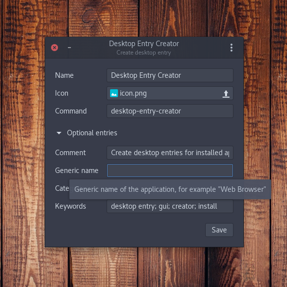

<p align="center">
  
</p>
<h1 align="center">Desktop entry creator</h1>

[![License][license-shield]](LICENSE)

A user-friendly GUI for creating desktop entries for installed applications on Linux.

<p align="center">
  
</p>

## Development

1. Install the required system packages:
   * Fedora
     ```bash
     sudo dnf install python3-devel cairo cairo-devel python3-cairo gobject-introspection gobject-introspection-devel cairo-gobject cairo-gobject-devel
     ```
2. Setup Python 3 virtual environment using Pipenv:
   ```bash
   pipenv --three
   ```
3. Activate the virtual enviroment and install the dependencies:
   ```bash
   pipenv shell
   pipenv install --dev
   ```
4. Run `app.py` located under the `app` directory to launch the GUI:
   ```bash
   ./app/app.py
   ```

## License

This project is licensed under the terms of the [GPL v3 license](LICENSE).


[license-shield]: https://img.shields.io/github/license/faheel/desktop-entry-creator.svg?style=for-the-badge
